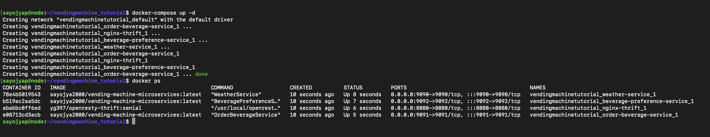

# Advanced Operating Systems Programming Assignment 2

## Group Members
- Neeraj Saini
- Sayojya Patil

## Overview
This project is a modified version of a microservices-based vending machine system. It includes enhancements to the existing services and the addition of a new microservice for beverage preference.

## Features Implemented
1. **Weather Service Update**:
   - Replaced random weather logic.
   - If `city_id` is **odd**, returns `WARM`.
   - If `city_id` is **even**, returns `COLD`.

2. **New Beverage Preference Service**:
   - A new microservice that selects a beverage based on the weather type.
   - If `Hot`: randomly returns one of `cappuccino`, `latte`, or `espresso`.
   - If `Cold`: randomly returns one of `lemonade`, `ice tea`, or `soda`.

3. **Integration in Order Beverage Service**:
   - `placeOrder(city)` calls `getWeather()`, determines beverage type, and fetches beverage from the new service.

4. **Updated Thrift Definitions**:
   - Added new service definitions and enums in `vending_machine.thrift`.

## Setup Instructions

### 1. Clone the Repository
```bash
git clone https://github.com/SayojyaPatil/AdvOS-Programming-Assignment-2.git
cd AdvOS-Programming-Assignment-2
```

### 2. Build and Run Services
```bash
docker-compose build
docker-compose up -d
```

### 3. Generate Requests
```bash
cd script
bash ./generate_request.sh > output.txt
```

### 4. Check Running Containers
```bash
docker ps -a
```

## Deliverables
- [`output.txt`](./output.txt): Script output showing selected beverages.
- : `docker ps -a` showing all four services running.
- [GitHub Repo](https://github.com/SayojyaPatil/AdvOS-Programming-Assignment-2)
- [Docker Hub Image](https://hub.docker.com/r/sayojya2000/vending-machine-microservices)
- [`Report (pdf)`](./AOS_Assignment-2_Report.pdf): One-page summary of implementation and reflection.
- [`README.md`](./README.md)


## Reflection
This project gave us real-world experience with building and integrating microservices using Docker, Thrift, and RPC. We learned to define services, manage builds with CMake, and orchestrate containers using Docker Compose. The hands-on experience improved our understanding of service-based architectures and containerization.

